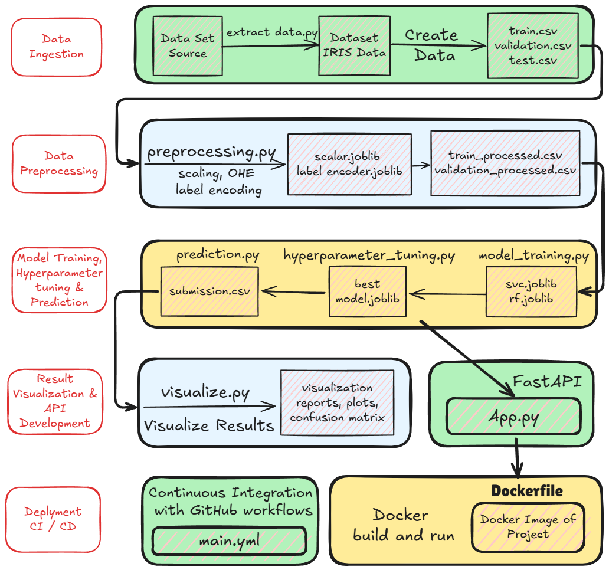

# End-to-End Machine Learning Pipeline with FastAPI and Docker

This repository implements a complete machine learning pipeline, from data preprocessing and model training to deployment and testing. It showcases a modular and scalable architecture for deploying ML models using **FastAPI**, **Docker**, and **GitHub Actions** for CI/CD and building scalable and reproducible solutions.

# Diagram


## Project Overview

### Key Features:
- **Data Preprocessing:** Clean, scale, and transform data using pipelines and save reusable preprocessors.
- **Model Training:** Train multiple models (Random Forest, SVM), perform hyperparameter tuning, and select the best-performing model.
- **Model Deployment:** Serve the trained model via a RESTful API using FastAPI.
- **Dockerization:** Deploy the entire project in a containerized environment.
- **Testing:** Unit and integration testing to ensure code quality and reliability.
- **Continuous Integration:** Automated CI pipeline using GitHub Actions.
- **User Interface:** A simple HTML form to input features and get predictions.

---

## Folder Structure

```
project/
│
├── .github/                  # Contains github workflow files
├── data/                     # Dataset files
├── data_extraction/          # Contains code for Data extraction pipeline
│   ├── dataset_extraction.py # Code for data extraction and data formation
├── Docker/                   # Docker-specific files
│   ├── Dockerfile            # Dockerfile for building the image
│   ├── .dockerignore         # Files to exclude during image build
├── fastapi_deployment/       # FastAPI application
│   ├── app.py                # Main API logic
├── hyperparamter_tuning/     # Code files related to hyperparameter tuning
│   ├── hyperparamter_tuning.py  # Code for hyperparameter tuning for the models
├── model_training/           # Code files related to model training
│   ├── model_training.py     # Code for model training from trainig data
├── models/                   # Saved models (e.g., best_model.joblib)
├── prediction/               # Code files related to prediction on test data
│   ├── prediction.py         # Code for model prediction on test data and result saving
├── preprocessing/            # Preprocessing scripts and pipelines
│   ├── preprocessing.py      # Code for preprocessing data, cleaning data and saving useful information
├── static/                   # Static HTML files for UI, other images and necessary files
├── tests/                    # Unit and integration tests
│   ├── test_app.py           # Tests for the FastAPI app
│   ├── test_models.py        # Tests for the model prediction
├── visualize_results/        # Result visualization files
│   ├── visualize.py          # Code for visualizing results, saving useful metrics 
├── .gitignore.txt            # Contains folders, items to be ignored while pushing any changes to git
├── docs.md                   # Contains docs for the steps
├── README.md                 # Project documentation
└── requirements.txt          # Python dependencies

```

---

## Setup Instructions

### Prerequisites:
- **Python 3.11**
- **Docker** and **Docker Compose**
- A virtual environment (optional but recommended)

### Step 1: Clone the Repository
```bash
git clone <repository_url>
cd project/
```

### Step 2: Install Dependencies
```bash
python -m venv .venv
source .venv/bin/activate  # For Linux/Mac
.venv\Scripts\activate     # For Windows
pip install -r requirements.txt
```

### Step 3: Data Creation

Before working with the pipeline, data needs to be prepared:

1. **Synthetic Data Generation** (if applicable):
   - If using synthetic data, generate it using a Python script (e.g., `generate_data.py`) or use libraries like `scikit-learn` for datasets such as classification, regression, or clustering. Here we have used Iris dataset to keep it simple.

2. **Data Loading**:
   - Load real-world datasets (e.g., CSV, JSON, or SQL tables) using `pandas` or other data wrangling tools.

3. **Train-Test Split**:
   - Split data into training and testing sets.
   - Save the processed data for reuse.

4. **Save Processed Data**:
   - Store the prepared data in the `data/` folder for further processing.

```bash
python data_extraction/data_extraction.py
```


### Step 4: Data Preprocessing

Transform the raw data into a format suitable for training:

1. **Data Cleaning**:
   - Handle missing values, duplicates, and irrelevant features.
   - Implement in a script like `preprocessing/data_cleaning.py`.

2. **Feature Engineering**:
   - Scale numerical features, encode categorical variables, and generate additional features.
   - Implement transformations using `scikit-learn`'s `Pipeline` or `ColumnTransformer`.

```bash
python preprocessing/preprocessing.py
```


### Step 5: Train and Save the Model
Run the `model_training.py` script to preprocess the data, train models, and save the best model:
```bash
python model_training/model_training.py
```


### Step 6: Hyperparameter Tuning

Optimize the model's performance by tuning hyperparameters:

1. **Define the Search Space**:
    - Specify the hyperparameters and their possible values to explore.
    - Use libraries like `scikit-learn`'s `GridSearchCV` or `RandomizedSearchCV`.

2. **Run the Hyperparameter Tuning Script**:
    - Execute the script to perform hyperparameter tuning and identify the best parameters.
    - Save the best model for future use.

3. **Evaluate the Best Model**:
    - Assess the performance of the tuned model on the validation set.
    - Save the evaluation metrics for comparison.

```bash
python hyperparameter_tuning/hyperparameter_tuning.py
```

### Step 7: Perform Prediction

After training and saving the model, you can perform predictions using the saved model:

1. **Prepare Input Data**:
    - Ensure the input data is in the same format as the training data.
    - Use the same preprocessing steps applied during training.

2. **Load the Model**:
    - Load the saved model and preprocessing pipeline from the `models/` directory.

3. **Make Predictions**:
    - Use the loaded model to make predictions on new data.

```bash
python prediction/prediction.py
```

This script will load the model, preprocess the input data, and output the predictions.


### Step 8: Run the FastAPI App
```bash
uvicorn fastapi_deployment.app:app --host 0.0.0.0 --port 8000 --reload
```
The app will be available at: [http://127.0.0.1:8000](http://127.0.0.1:8000).

### Step 9: Build and Run with Docker
1. **Build the Docker Image:**
   ```bash
   docker build -f Docker/Dockerfile -t my-fastapi-app .
   ```
2. **Run the Docker Container:**
   ```bash
   docker run -d -p 8000:8000 my-fastapi-app
   ```

### Step 8: Test the API
Access the Swagger documentation at: [http://127.0.0.1:8000/docs](http://127.0.0.1:8000/docs)  
Use the provided UI in `static/index.html` to input feature values and get predictions.

---

## API Endpoints

### `/predict`
- **Method:** POST  
- **Input:** JSON payload with feature values (e.g., SepalLength, SepalWidth, PetalLength, PetalWidth for Iris data).  
- **Output:** Predicted class and probability.

---

## Testing the Project

### Unit Tests
Run all tests using:
```bash
pytest tests/
```

### Logging
Request and response logs can be monitored via `docker logs` or terminal logs during development.

---

## Key Highlights and Lessons

1. **Reusable Pipelines:** Preprocessors are saved and reused across the pipeline, ensuring consistency.
2. **Model Persistence:** Both preprocessing pipelines and models are serialized using `joblib`.
3. **CI/CD with GitHub Actions:** Automated linting, testing, and deployment ensure code quality.
4. **Scalable Architecture:** Modular folder structure for easy extension and maintainability.
5. **Dockerization:** Containerization makes the application portable and environment-independent.

---

## Challenges and Solutions

1. **Handling Missing Modules in Docker:** Resolved by including necessary dependencies in `requirements.txt`.
2. **Testing Failures:** Added comprehensive unit and integration tests in the `tests/` directory.
3. **File Path Issues:** Ensured correct relative paths for models and preprocessors in both local and containerized environments.
4. **Logging:** Added request-response logging for better debugging in production.

---

## Future Enhancements

1. Add a database for logging requests and predictions.
2. Implement authentication for the API.
3. Extend the UI for a better user experience.

---

## Contributing

Contributions are welcome! Please open an issue or submit a pull request.

---

## Authors and Acknowledgements

Developed by Varun Sakunia. Acknowledgments to OpenAI's GPT for assistance with troubleshooting and documentation.

---

## License

This project is licensed under the MIT License.

---

Let me know if you’d like to customize further!

## Additional Commands

### Bypass Execution Policy (Windows)

Use the following command to bypass policies restricting scripts from running:
```sh
Set-ExecutionPolicy -Scope Process -ExecutionPolicy Bypass
```
This will only apply to the current PowerShell session.

```sh
Set-ExecutionPolicy -Scope CurrentUser -ExecutionPolicy RemoteSigned
```
This will allow scripts signed by a trusted publisher to run for the current user.

### Activate Virtual Environment (Windows)

Use the following command to activate the virtual environment:
```sh
.\.venv\Scripts\activate
```